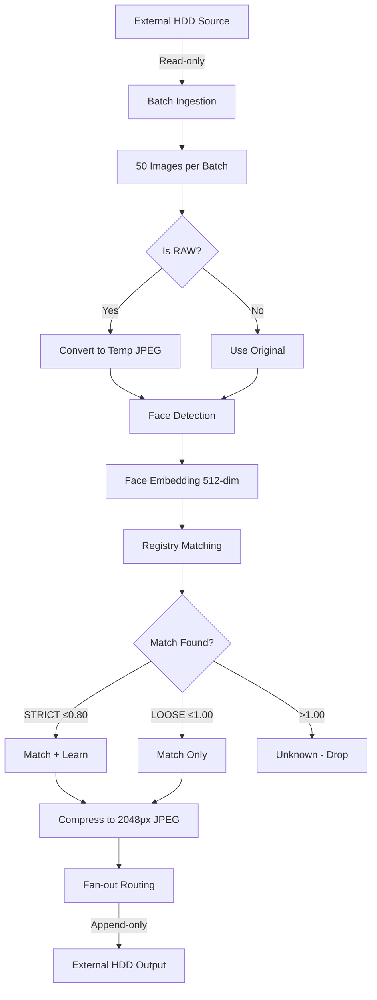
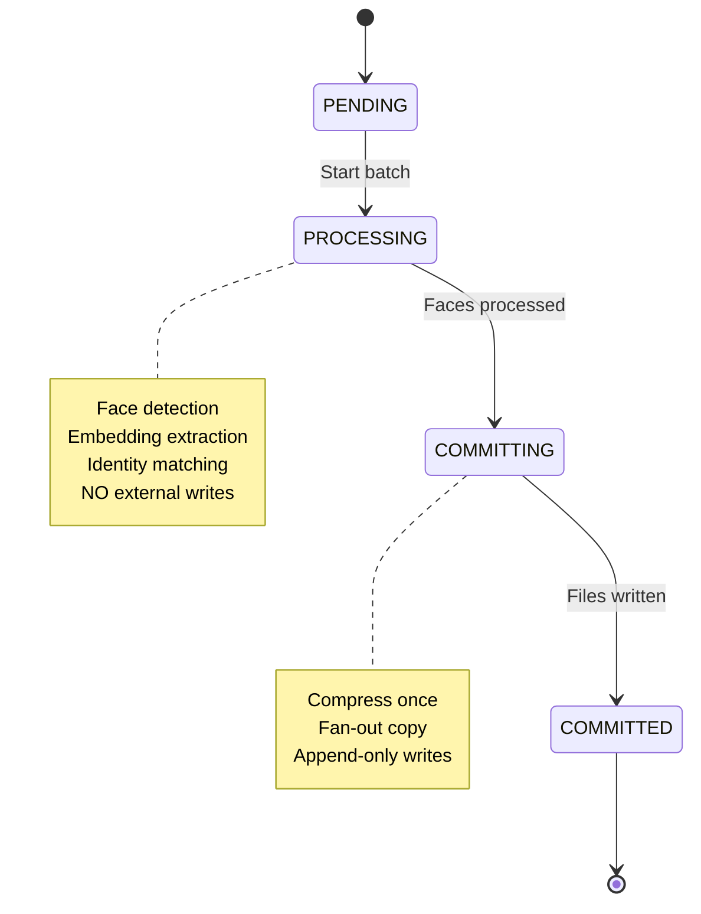

# Offline Face-Based Event Photo Segregation System

A production-grade, offline system for sorting large event photo datasets (~16,000+ images) by face recognition. The system routes images into person-specific folders with support for group photos (fan-out to multiple folders).

## Features

- **Offline-only**: No cloud services, all models run locally
- **Large-scale**: Handles 16,000+ images efficiently
- **Face recognition**: InsightFace-based detection and embedding
- **Group photos**: Automatic fan-out routing to multiple person folders
- **Crash-safe**: Atomic batch processing with resume support
- **External HDD safe**: Read-only source, append-only output

## Quick Start

### 1. Install Dependencies

```bash
# Create virtual environment (recommended)
python -m venv venv
venv\Scripts\activate  # Windows
# source venv/bin/activate  # Linux/Mac

# Install requirements
pip install -r requirements.txt
```

### 2. Start the Server

```bash
cd backend
python scripts/run_server.py
```

Open http://127.0.0.1:8000 in your browser.

### 3. Configure Job (Operator UI)

1. Go to **Operator Panel**
2. Set **Source Directory** (your event photos on external HDD)
3. Set **Output Directory** (where sorted photos will go)
4. Click **Save Configuration**

### 4. Seed Person Identities

1. In Operator Panel, scroll to **Person Registry**
2. Enter person's name and output folder name
3. Upload a clear reference photo (exactly ONE face visible)
4. Click **Add Person**
5. Repeat for all persons to track

### 5. Start the Worker

In a new terminal:

```bash
cd backend
python scripts/run_worker.py
```

### 6. Monitor Progress (Tracker UI)

Go to http://127.0.0.1:8000/tracker to watch progress.

---

## Architecture

```
┌─────────────────────────────────────────────────────────────────┐
│                    External HDD (Cold Storage)                   │
├─────────────────────────────────┬───────────────────────────────┤
│  Source Directory (READ-ONLY)   │  Output Directory (APPEND-ONLY)│
│  - Event photos (.jpg, .arw)    │  - /Person_A/                  │
│  - Never modified               │  - /Person_B/                  │
│                                 │  - /Person_C/                  │
└─────────────────────────────────┴───────────────────────────────┘
                │                              ▲
                │ Read                         │ Write (append-only)
                ▼                              │
┌─────────────────────────────────────────────────────────────────┐
│                    Internal Disk (Hot Storage)                   │
├─────────────────────────────────────────────────────────────────┤
│  ./hot_storage/                                                  │
│  ├── registry.db          # SQLite database                     │
│  ├── state/               # Tracker state files                 │
│  │   ├── progress.json    # Overall progress                    │
│  │   ├── batches/         # Per-batch state                     │
│  │   └── worker_heartbeat.json                                  │
│  ├── staging/             # Compressed images before routing    │
│  ├── temp/                # Temporary RAW conversions           │
│  └── models/              # InsightFace models (~300MB)         │
└─────────────────────────────────────────────────────────────────┘
```

## Processing Pipeline



## Batch State Machine

Every batch of 50 images follows this state machine:



### Resume Behavior

| Crash During | Recovery Action |
|--------------|-----------------|
| PENDING | Skip (not started) |
| PROCESSING | Reset to PENDING (reprocess) |
| COMMITTING | Run commit reconciliation |
| COMMITTED | Skip forever |

---

## System Invariants

These rules are **non-negotiable** and enforced at all times:

### Storage Semantics

1. **Source is READ-ONLY**: Never write to the source directory
2. **Output is APPEND-ONLY**: Never overwrite or delete output files
3. **Hot storage for computation**: All temporary work on internal disk

### Batch Semantics

1. **Atomic batch size = 50 images**: Crash can affect at most 50 images
2. **No external writes during PROCESSING**: Only during COMMITTING phase
3. **Idempotent commits**: Same input always produces same output

### Output Policy (Locked)

| Setting | Value |
|---------|-------|
| Format | JPEG only |
| Max long edge | 2048 px |
| Quality | 85 |
| Color space | sRGB |
| Metadata | Stripped |

### Matching Thresholds

| Threshold | Distance | Behavior |
|-----------|----------|----------|
| STRICT | ≤ 0.80 | Auto-match + learn embedding |
| LOOSE | ≤ 1.00 | Match only (no learning) |
| Unknown | > 1.00 | Drop (no output) |

*Note: Distances are Euclidean on L2-normalized 512-dim embeddings (range 0-2).*

---

## Failure Scenarios & Recovery

### Scenario 1: Power Loss During Processing

**What happens**: Worker was in PROCESSING state
**Recovery**: On restart, batch is reset to PENDING and reprocessed from scratch
**Data loss**: None (no external writes during PROCESSING)

### Scenario 2: HDD Disconnect During Commit

**What happens**: Worker was writing files to external HDD
**Recovery**: Commit reconciliation checks each pending write:
- If file exists on HDD: Mark as verified
- If file exists in staging: Copy to HDD
- If both missing: Mark as failed (need reprocess)
**Data loss**: At most 50 images may need reprocessing

### Scenario 3: Duplicate Source Files

**What happens**: Same image exists in multiple source locations
**Recovery**: SHA-256 hash ensures same file produces same output filename
**Behavior**: Second copy is skipped (append-only prevents overwrite)

### Scenario 4: Worker Crashes Mid-Batch

**What happens**: Worker process terminates unexpectedly
**Recovery**: Resume logic on restart handles:
- PROCESSING → reset to PENDING
- COMMITTING → reconcile and complete
**Data loss**: None if PROCESSING, at most 50 images if COMMITTING

---

## Trade-offs & Design Decisions

### Why CPU-Only?

**Decision**: Use ONNX Runtime with CPU provider
**Trade-off**: Slower than GPU (~2-3 images/second vs 20+/second)
**Rationale**: 
- Works on any machine without CUDA setup
- More reliable for long-running batch jobs
- 16,000 images at 2 img/s = ~2.5 hours (acceptable)

### Why Compress Before Routing?

**Decision**: Compress once, copy N times
**Trade-off**: Uses more staging space temporarily
**Rationale**:
- Avoids N compressions for N-person group photo
- Ensures all copies are byte-identical
- Faster overall for group photos

### Why Not Stream Directly to HDD?

**Decision**: Stage to internal disk, then copy to HDD
**Trade-off**: Requires staging space (~50 × 2MB = 100MB max)
**Rationale**:
- HDD disconnect during write won't corrupt internal state
- Can verify file before committing
- Atomic rename not reliable across filesystems

### Why 50-Image Batches?

**Decision**: Fixed atomic batch size of 50
**Trade-off**: More database overhead vs larger batches
**Rationale**:
- 50 images × 50MB = 2.5GB max memory for RAW
- ~25 seconds per batch (reasonable checkpoint)
- Crash loses at most 25 seconds of work

### Why Drop Unknown Faces?

**Decision**: Images with only unknown faces are not output
**Trade-off**: May miss some photos
**Rationale**:
- No manual review in spec
- Can add `_unknown/` folder later if needed
- Prevents cluttering output with unmatched images

---

## Database Schema

### Person Registry

```sql
-- Core identity
persons (person_id, name, output_folder_rel, created_at)

-- Multiple embeddings per person (bounded, FIFO)
person_embeddings (embedding_id, person_id, embedding, source_type)

-- Precomputed centroid for fast matching
person_centroids (person_id, centroid, embedding_count)
```

### Job State

```sql
-- Job configuration (singleton)
job_config (source_root, output_root)

-- Job execution
jobs (job_id, source_root, output_root, total_images, processed_images, status)

-- Discovered images
images (image_id, job_id, source_path, filename, extension, sha256, ordering_idx)

-- Atomic batches
batches (batch_id, job_id, start_idx, end_idx, state)
```

### Processing Results

```sql
-- Per-image results
image_results (image_id, batch_id, face_count, matched_count, unknown_count, matched_person_ids)

-- Append-only commit log
commit_log (batch_id, image_id, person_id, output_filename, output_path, status)
```

---

## API Reference

### Operator Endpoints

| Method | Path | Description |
|--------|------|-------------|
| GET | `/api/operator/job-config` | Get current job configuration |
| POST | `/api/operator/job-config` | Set job configuration |
| GET | `/api/operator/persons` | List all registered persons |
| POST | `/api/operator/seed-person` | Add new person with reference image |

### Tracker Endpoints (Read-Only)

| Method | Path | Description |
|--------|------|-------------|
| GET | `/api/tracker/progress` | Get current progress |
| GET | `/api/tracker/worker-status` | Check if worker is online |

---

## File Structure

```
Image_Segregation/
├── requirements.txt
├── README.md
└── backend/
    ├── app/
    │   ├── main.py              # FastAPI app
    │   ├── config.py            # Settings
    │   ├── api/
    │   │   ├── operator.py      # Operator endpoints
    │   │   └── tracker.py       # Tracker endpoints
    │   ├── db/
    │   │   ├── schema.sql       # Database schema
    │   │   ├── db.py            # Connection handling
    │   │   ├── registry.py      # Person operations
    │   │   └── jobs.py          # Job/batch operations
    │   ├── engine/
    │   │   ├── batch_engine.py  # State machine
    │   │   ├── faces.py         # Face detection
    │   │   ├── match.py         # Identity matching
    │   │   ├── ingest.py        # Image discovery
    │   │   ├── compress.py      # JPEG compression
    │   │   ├── raw_convert.py   # ARW handling
    │   │   └── routing.py       # Fan-out routing
    │   ├── state/
    │   │   └── state_writer.py  # Progress files
    │   ├── storage/
    │   │   └── paths.py         # Path validation
    │   ├── worker/
    │   │   └── runner.py        # Worker process
    │   ├── templates/           # HTML templates
    │   └── static/              # CSS/JS assets
    └── scripts/
        ├── run_server.py        # Start API server
        └── run_worker.py        # Start batch worker
```

---

---

## Tech Stack

| Layer | Technology | Purpose |
|-------|------------|---------|
| **Backend** | [Python 3.10+](https://www.python.org/) | Core runtime |
| **Web Framework** | [FastAPI](https://fastapi.tiangolo.com/) | REST API & web server |
| **ASGI Server** | [Uvicorn](https://www.uvicorn.org/) | Production async server |
| **Database** | [SQLite](https://www.sqlite.org/) | Local embedded database |
| **Face Detection** | [InsightFace](https://github.com/deepinsight/insightface) | Face detection & recognition |
| **ML Runtime** | [ONNX Runtime](https://onnxruntime.ai/) | Cross-platform model inference |
| **Image Processing** | [Pillow (PIL)](https://pillow.readthedocs.io/) | JPEG compression & resizing |
| **RAW Processing** | [rawpy](https://github.com/letmaik/rawpy) | Sony ARW file conversion |
| **Array Operations** | [NumPy](https://numpy.org/) | Embedding math & image arrays |
| **Async HTTP** | [aiofiles](https://github.com/Tinche/aiofiles) | Async file operations |
| **Frontend** | Vanilla HTML/CSS/JS | No framework dependencies |

---

## Acknowledgments & Credits

This project is built on top of several amazing open-source libraries:

### Core Dependencies

- **[InsightFace](https://github.com/deepinsight/insightface)** - State-of-the-art face detection and recognition library
  - Model: `buffalo_l` (RetinaFace detection + ArcFace recognition)
  - License: MIT License
  - Paper: [ArcFace: Additive Angular Margin Loss for Deep Face Recognition](https://arxiv.org/abs/1801.07698)

- **[ONNX Runtime](https://github.com/microsoft/onnxruntime)** - High-performance ML inference by Microsoft
  - License: MIT License

- **[FastAPI](https://github.com/tiangolo/fastapi)** - Modern, fast web framework for building APIs
  - License: MIT License

- **[Pillow](https://github.com/python-pillow/Pillow)** - Python Imaging Library fork
  - License: HPND License

- **[rawpy](https://github.com/letmaik/rawpy)** - RAW image processing for Python (wrapper around LibRaw)
  - License: MIT License

- **[NumPy](https://github.com/numpy/numpy)** - Fundamental package for scientific computing
  - License: BSD License

### Model Weights

The face recognition models are downloaded automatically from InsightFace's model zoo:
- Detection: RetinaFace (det_10g.onnx)
- Recognition: ArcFace (w600k_r50.onnx)
- These models are trained on publicly available face datasets

---

## License

MIT License

Copyright (c) 2026

Permission is hereby granted, free of charge, to any person obtaining a copy
of this software and associated documentation files (the "Software"), to deal
in the Software without restriction, including without limitation the rights
to use, copy, modify, merge, publish, distribute, sublicense, and/or sell
copies of the Software, and to permit persons to whom the Software is
furnished to do so, subject to the following conditions:

The above copyright notice and this permission notice shall be included in all
copies or substantial portions of the Software.

THE SOFTWARE IS PROVIDED "AS IS", WITHOUT WARRANTY OF ANY KIND, EXPRESS OR
IMPLIED, INCLUDING BUT NOT LIMITED TO THE WARRANTIES OF MERCHANTABILITY,
FITNESS FOR A PARTICULAR PURPOSE AND NONINFRINGEMENT. IN NO EVENT SHALL THE
AUTHORS OR COPYRIGHT HOLDERS BE LIABLE FOR ANY CLAIM, DAMAGES OR OTHER
LIABILITY, WHETHER IN AN ACTION OF CONTRACT, TORT OR OTHERWISE, ARISING FROM,
OUT OF OR IN CONNECTION WITH THE SOFTWARE OR THE USE OR OTHER DEALINGS IN THE
SOFTWARE.

---

## Privacy Notice

This is a **fully offline tool**:
- ✅ No cloud services
- ✅ No data leaves your machine
- ✅ All face recognition runs locally
- ✅ No telemetry or analytics

